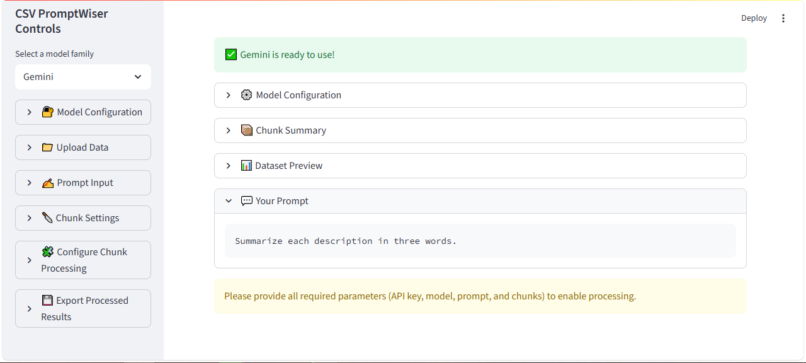
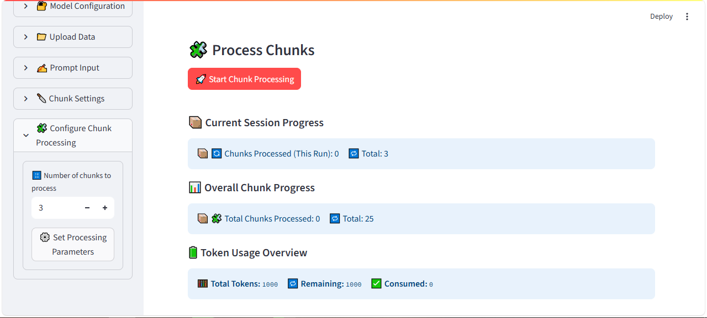
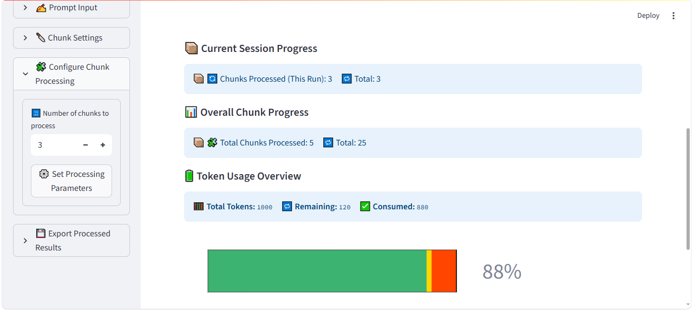

# CSV PromptWiser — Streamlit App for RAG on CSV Files with LLMs (ChatGPT, Gemini)






CSV PromptWiser is an **open-source Streamlit app** that enables a **lightweight Retrieval-Augmented Generation (RAG) workflow** on CSV/Parquet files.  
It chunks your dataset into context-friendly pieces and processes them using **Large Language Models (LLMs) such as ChatGPT and Gemini**.  

By chunking tabular data, you can **avoid LLM context/token limits** while still running powerful queries, data enrichment, and summarization over large files.  

---

## ✨ Features
- 📂 Upload CSV/Parquet files and split them into context-sized chunks  
- 🔍 Built for lightweight **RAG workflows** on structured data  
- ⚙️ Configure chunk size & manage token budgets  
- 🤖 Process chunks with popular LLMs (ChatGPT, Gemini, etc.)  
- 🔄 Track progress with live status updates  
- 💾 Save results locally (SQLite DB) and export processed CSVs  
- 🎛️ Simple Streamlit interface with collapsible panels  

---

## 💡 Use Cases
- Run **RAG workflows on CSV/Parquet data**  
- Chunk large datasets to **avoid hitting LLM context limitations**  
- Ask **natural language questions** over tabular data with ChatGPT or Gemini  
- Enrich and transform CSV files using **prompt-driven AI**  
- Automate **retrieval and generation** on structured datasets  

---

## 🚀 Quickstart

```bash
# 1. Clone the repo
git clone https://github.com/reevolvex/CSVPromptWiser.git
cd CSVPromptWiser

# 2. Create & activate virtual environment
python -m venv .venv
source .venv/bin/activate   # macOS/Linux
.venv\Scripts\Activate.ps1  # Windows (PowerShell)
.venv\Scripts\activate.bat  # Windows (Command Prompt)


# 3. Install dependencies
pip install -r requirements.txt

# 4. Set environment variables
# create a .env file in the root directory and add the following variables
GEMINI_API_KEY=your_gemini_api_key

# 5. Create .streamlit directory in the root directory and add a secrets.toml with these variables
is_local = true
GEMINI_API_KEY = "your-gemini-key"

# 5. Run the app
streamlit run app.py
```

---

## 📊 Typical Workflow
1. Select an LLM family (Gemini, ChatGPT, etc.)  
2. Enter your API key in the sidebar  
3. Upload a CSV/Parquet file  
4. Write a custom prompt (e.g., *“Summarize each row”* or *“Extract insights by column”*)  
5. Configure chunk size and token budget  
6. Start processing chunks and track progress in real time  
7. Export processed results when complete  

---

## 📂 Project Structure

```bash
CSVPromptWiser/
├── app.py              # Streamlit entry point
├── requirements.txt    # Dependencies
├── streamlit_dir/      # Sidebar + UI components
├── model/              # Chunking + LLM logic
├── utils/              # Constants and helpers
└── tests/              # Test suite
```

---

## 🤝 Contributing

Contributions are welcome!

- Fork the repo
- Create a feature branch (git checkout -b feature/awesome)
- Commit your changes (git commit -m 'Add feature')
- Push to your branch and open a PR

---

## 📝 License
Licensed under the BSD 3‑Clause License.  
Use, modification, and distribution are permitted with proper attribution.  
See [LICENSE](LICENSE) for details.

---

## 🙌 Acknowledgements
- [Streamlit](https://streamlit.io/)
- [Google Gemini API](https://cloud.google.com/vertex-ai)
- [OpenAI API](https://openai.com/api/)


